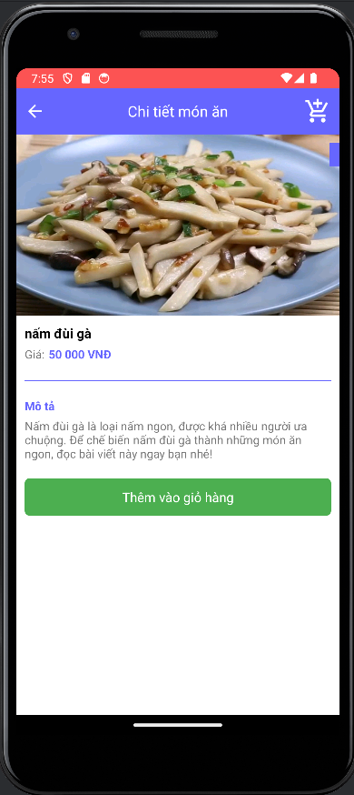

# Technology used:
### Language: 
### Database:  

# About Project:
The project uses Java and Firebase. Firebase services utilized include: Authentication for user verification and Realtime Database for data storage. 
The system supports two roles: User and Admin. 

- User functionalities include: register, log in, log out, change password, search products, manage shopping cart, and review products. 

- Admin functionalities include: log in, log out, change password, manage orders, view reviews, manage products, and view report.

# Preview: 
### User: 
 

### Admin: 

#### Add Food: 

#### Edit Food: 

#### Delete Food: 

