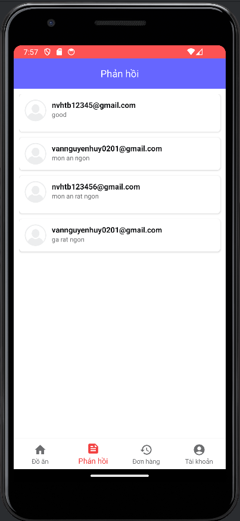
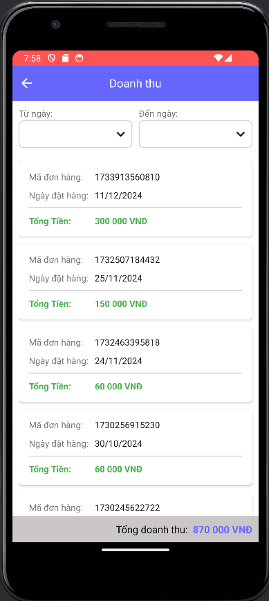
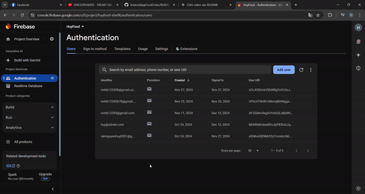

# Technology used:
 
  
Libraries & Frameworks: Retrofit - Efficient API request handling,Glide - Optimized image loading from URLs.

# About Project:
The project uses Java and Firebase. Firebase services utilized include: Authentication for user verification and Realtime Database for data storage. 
Libraries & Frameworks: Retrofit - Efficient API request handling,Glide - Optimized image loading from URLs. 
The system supports two roles: User and Admin. 

- User functionalities include: register, log in, log out, change password, search products, manage shopping cart, and review products. 

- Admin functionalities include: log in, log out, change password, manage orders, view reviews, manage products, and view report.

# Preview: 
<table>
  <tr>
    <td></td>
    <td></td>
    <td></td>
  </tr>
  <tr>
    <td></td>
    <td></td>
    <td></td>
  </tr>
  <tr>
    <td></td>
    <td></td>
    <td></td>
  </tr>
  <tr>
    <td></td>
    <td></td>
  </tr>
</table>

<table>
  <tr>
    <td></td>
    <td></td>
    <td></td>
  </tr>
  <tr>
    <td></td>
    <td></td>
    <td></td>
  </tr>
  <tr>
    <td></td>
    <td></td>
  </tr>
</table>

#### Add Food: 
Using Glide is a popular library in Android to efficiently load and display images. It helps load images from a URL, internal storage, or other sources and display them in an ImageView.

#### Edit Food: 

#### Delete Food: 

#### Database: 

